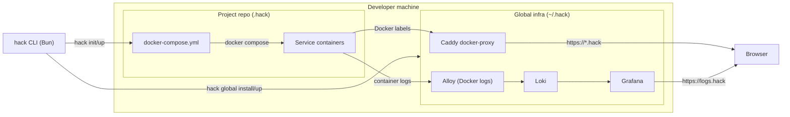
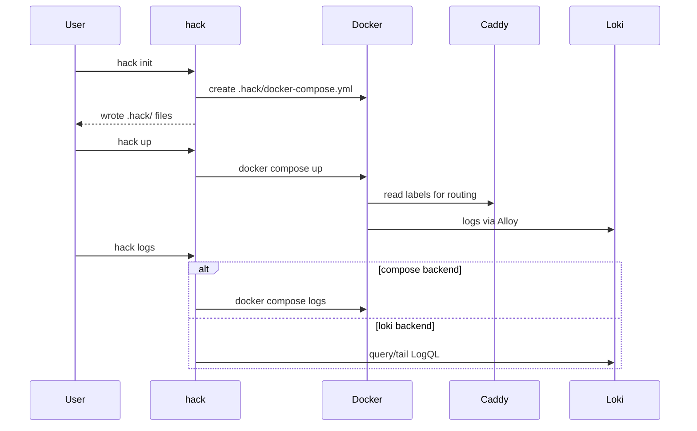
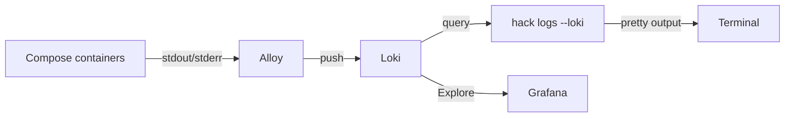

# Architecture

## Why this exists (plain English)

Running multiple local projects at the same time is messy when everything wants the same ports and
"localhost". This CLI gives each repo its own isolated network and stable HTTPS hostnames so you can:

- run many apps concurrently without port juggling
- keep service defaults (Postgres on 5432, Redis on 6379) inside each project
- access every app via predictable `https://<project>.hack`
- get fast local logs plus searchable history

## System overview

`hack` is a Bun CLI that writes per-project Compose files under `.hack/` and manages a machine-wide
proxy + logging stack under `~/.hack/`. Caddy routes `*.hack` based on container labels and the
logging stack (Alloy + Loki + Grafana) captures Docker Compose logs.

## Global vs project scope

- Global scope (`~/.hack`)
  - Caddy proxy listens on 80/443 and routes `https://*.hack` via Docker labels
  - Logging stack captures all Compose logs (Alloy → Loki → Grafana)
  - Networks: `hack-dev` (ingress) and `hack-logging`

- Project scope (`.hack`)
  - `docker-compose.yml` defines services and optional Caddy labels
  - `hack.config.json` stores project name, dev host, log preferences, OAuth alias

## Lifecycle (init → up → logs)

## Logging pipeline

## Files and directories

- `~/.hack/`
  - `caddy/docker-compose.yml`
  - `logging/docker-compose.yml`
  - `logging/alloy.alloy`
  - `logging/loki.yaml`
  - `logging/grafana/...`
  - `schemas/hack.config.schema.json`
  - `schemas/hack.branches.schema.json`
  - `projects.json` (best-effort registry)

- `<repo>/.hack/`
  - `docker-compose.yml`
  - `hack.config.json`
  - `hack.branches.json` (optional)

## Key design choices

- Docker Compose is the execution substrate for predictability and portability.
- Caddy routes by container label so there is no per-repo reverse proxy config.
- Logs default to `docker compose logs` for speed, with Loki for history and filtering.
- Config lives alongside each repo in `.hack/` to keep repos isolated and portable.