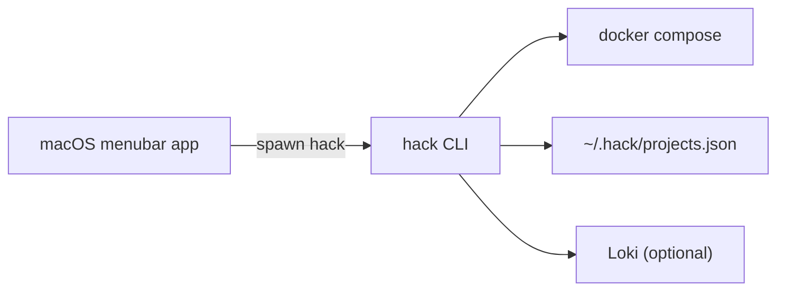

# Mac desktop app spec (minimal status viewer)

## Summary

A tiny macOS menubar app that shows running `hack` projects and lets you start/stop/open them with one click. It is intentionally minimal: glanceable status + quick actions.

## Goals

- Show active projects and key services at a glance.
- Provide quick actions: Up, Down, Restart, Open, Logs.
- Avoid heavy UI; keep it fast and always available.
- Work even when the CLI is updated independently.

## Non-goals

- Full log exploration UI (Grafana already covers history).
- Full Compose editing or schema management.

## UI concept

- **Menubar icon** with badge (running projects count).
- **Dropdown list**:
  - Project name, status (running/stopped/mixed), service count.
  - Actions: `Up`, `Down`, `Restart`, `Open`.
- **Details window** (optional):
  - Services list with status.
  - Quick links to `https://<project>.hack` and `https://logs.hack`.

## Data sources

Primary (preferred):
- `hack projects --json` (future JSON output).
- `hack ps --project <name> --json` for service status.

Fallback (no JSON mode yet):
- Read `~/.hack/projects.json` and call `hack ps` per project.

## Actions

- Start: `hack up --project <name> --detach`
- Stop: `hack down --project <name>`
- Restart: `hack restart --project <name>`
- Open: `hack open --project <name>`
- Logs: `hack open logs`

## Implementation approach

- **SwiftUI** menubar app (AppKit hosting).
- **Process runner** that calls `hack` with explicit args and captures stdout/stderr.
- **Polling loop** every 3–5 seconds (or use file watcher for `projects.json`).
- **Graceful degradation** when CLI or Docker is unavailable.

## Error handling

- Show a compact banner for CLI/Docker errors.
- Provide a “Run hack doctor” quick action on failures.

## Architecture diagram

## Future enhancements

- Live updates via a small local daemon or Docker events.
- JSON output mode for all commands to remove parsing.
- Simple log tail viewer (compose-based) for quick diagnosis.
