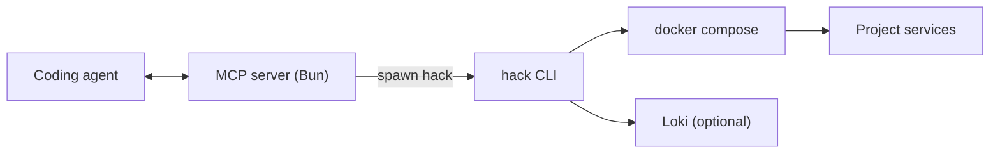

# MCP server spec: hack CLI bridge

## Summary

Provide a small MCP server that exposes safe, structured access to the `hack` CLI so coding agents can:
- create or activate a project (including new worktrees)
- start/stop services
- check status
- tail logs

The server should be conservative and allowlisted, with predictable JSON outputs for automation.

## Goals

- Allow agents to manage project lifecycle (`init`, `up`, `down`, `restart`, `ps`).
- Enable logs and status in a structured format (JSON, streaming logs).
- Support worktree-based branch setups for parallel dev servers.
- Be safe by default (no arbitrary shell execution).
- Run fast locally with minimal dependencies (Bun only).

## Non-goals

- Remote orchestration across machines (local-only at first).
- Full git hosting or CI workflows.
- Parsing or modifying arbitrary Compose files.

## Proposed tool surface

All tools return JSON and include a `command`, `exitCode`, `stdout`, and `stderr` payload for auditing.

### Project lifecycle
- `hack.projects.list` → list projects (future: `hack projects --json`)
- `hack.project.status` → project service status (`hack ps`)
- `hack.project.init` → init a repo (`hack init --manual` or interactive disabled)
- `hack.project.up` → start services
- `hack.project.down` → stop services
- `hack.project.restart` → restart services
- `hack.project.open` → open a URL (returns URL instead of launching browser)

### Logs
- `hack.project.logs.snapshot` → fetch log snapshot (compose or Loki)
- `hack.project.logs.tail` → stream logs (WebSocket or SSE) from compose/Loki

### Worktree / branch management (optional)
- `git.worktree.create` → create a new worktree + branch
- `hack.project.bootstrap` → in worktree: `hack init` + `hack up --detach`

## Inputs and outputs (shape)

### Project reference
- `projectName` (string, preferred)
- `repoRoot` (string, optional if projectName is provided)
- `path` (string, optional; resolved against server root allowlist)

### Example response
```json
{
  "ok": true,
  "command": "hack ps --project my-app",
  "exitCode": 0,
  "stdout": "...",
  "stderr": "",
  "data": {
    "project": "my-app",
    "services": [
      {"name": "api", "status": "running"}
    ]
  }
}
```

## Security and safety

- **Allowlist only**: no arbitrary args; tools map to known `hack` commands.
- **Path allowlist**: only operate inside configured repo roots.
- **No shell**: use `Bun.spawn` with args array.
- **Timeouts**: enforce per-command timeouts.
- **Audit log**: record every invocation (timestamp, cmd, exit code).

## Implementation approach

- Bun-based MCP server with a simple router per tool.
- Central command runner that:
  - resolves project context
  - maps tool inputs to CLI arguments
  - collects stdout/stderr
  - returns structured JSON
- Optional log streaming uses:
  - `hack logs --pretty` for local compose
  - Loki WebSocket tail for long-running streams

## Architecture diagram



## Phase plan

1. **Phase 1 (core)**: list projects, up/down/restart, ps, logs snapshot.
2. **Phase 2 (streaming)**: logs tail, event streaming.
3. **Phase 3 (worktrees)**: branch + worktree lifecycle, bootstrap flow.
