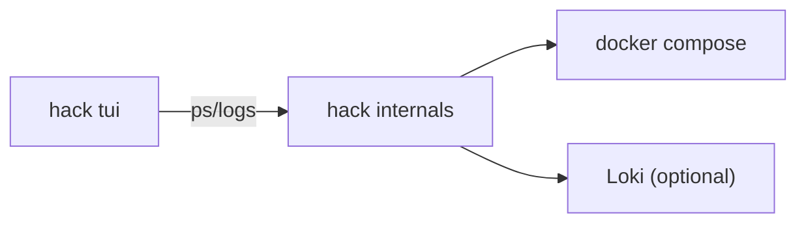

# TUI spec: full-screen project console

## Summary

A full-screen TUI for a single project that acts like a compact ops console: services list, status/health, live logs, and quick actions (open, restart, down).

## Goals

- Provide a fast, keyboard-driven overview for one project.
- Show service status, health, and container counts.
- Stream logs per-service or aggregated.
- Offer quick actions without leaving the terminal.

## Non-goals

- Full multi-project management (use `hack projects` or the menubar app).
- Advanced log search (Grafana/Loki already cover this).

## Command proposal

- `hack tui` (default: current project)
- `hack tui --project <name>` (target another project)
- Optional: `hack tui --backend compose|loki`

## Layout

```
┌──────────────────────────────────────────────────────────┐
│ Project: my-app        Status: running   Host: my-app.hack│
├───────────────┬──────────────────────────────────────────┤
│ Services      │ Logs (service: api)                      │
│───────────────│                                          │
│ api   running │ [03:22:10] INFO Server started           │
│ www   running │ [03:22:12] INFO GET /health              │
│ worker stopped│ [03:22:15] WARN queue lagging            │
│ db    running │                                          │
│ redis running │                                          │
├───────────────┴──────────────────────────────────────────┤
│ [o] open  [l] logs  [r] restart  [d] down  [q] quit       │
└──────────────────────────────────────────────────────────┘
```

## Key interactions

- Arrow keys / j,k: move service selection.
- Enter: focus logs for selected service.
- `a`: toggle aggregate logs (all services).
- `o`: open service (browser).
- `r`: restart service or project.
- `d`: stop project.
- `g`: open Grafana.
- `q`: quit.

## Data sources

- Status: `docker compose ps` (or `hack ps --json` when available).
- Logs:
  - Compose backend for low latency (default).
  - Loki backend for history/search (optional).

## Implementation approach

- Bun + a TUI library (e.g. `blessed` or `neo-blessed`).
- Reuse existing log formatting (`src/ui/log-format.ts`).
- Adopt structured outputs in CLI to avoid parsing.

## Error handling

- If Docker/Loki is unreachable, show a non-blocking banner in the status bar.
- Fall back to compose logs when Loki is not available.

## Architecture diagram



## Phased delivery

1. **v0**: status + log tail for one service.
2. **v1**: service switching + aggregate logs.
3. **v2**: quick actions (open/restart/down).
4. **v3**: Loki backend toggle and search input.
