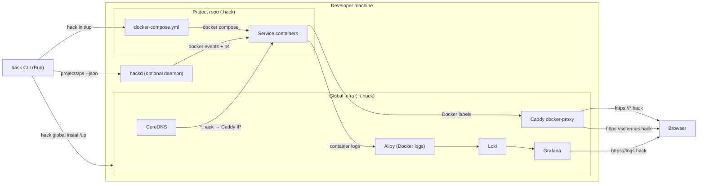
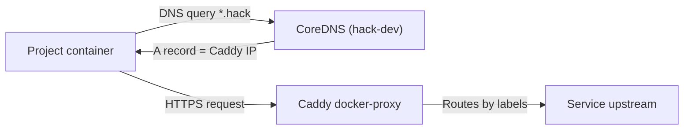
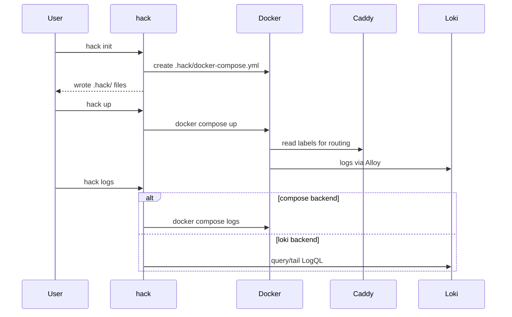
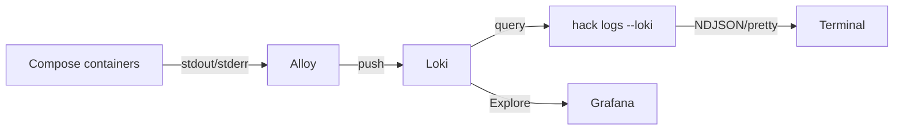
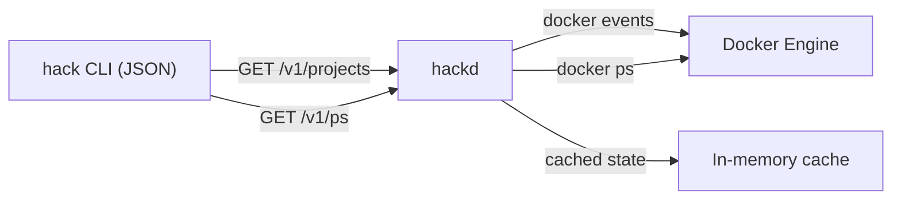
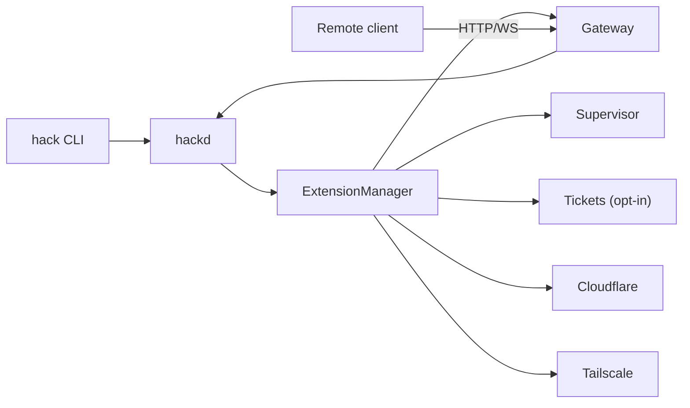

## System overview
 
`hack` is a Bun CLI that writes per-project Compose files under `.hack/` and manages a machine-wide
proxy, DNS helpers, and logging stack under `~/.hack/` (overridable via the `HACK_HOME` env var,
which redirects all global state — registry, daemon, secrets — to another root).

- **Caddy** (docker-proxy) routes `*.hack` based on container labels.
- **CoreDNS** resolves `*.hack` inside containers to the Caddy IP, with `extra_hosts` mappings for resolver compatibility.
- **Alloy + Loki + Grafana** capture logs and provide history.
- **Schemas** are served by Caddy at `https://schemas.hack`.
- **hackd (optional daemon)** caches Docker state for fast `hack projects --json` / `hack ps --json`.

## Global vs project scope

- Global scope (`~/.hack`)
  - Caddy proxy on 80/443 (routes via Docker labels)
  - CoreDNS for container DNS (`*.hack` → Caddy)
  - macOS DNS helper: dnsmasq + `/etc/resolver` for `*.hack` → Caddy container IP
  - Logging stack (Alloy → Loki → Grafana)
  - Global config: `hack.config.json` (control plane defaults + extension settings)
    - Gateway bind/port/allowWrites
  - Schemas hosted under `https://schemas.hack`
  - Networks: `hack-dev` (ingress) and `hack-logging`

- Project scope (`.hack`)
  - `docker-compose.yml` defines services + Caddy labels
  - `hack.config.json` stores project name, dev host, log preferences, OAuth alias
  - `controlPlane.gateway.enabled` marks the project as gateway-capable
  - Optional overrides:
    - `.internal/compose.override.yml` (generated internal DNS/TLS injection)
    - `.internal/extra-hosts.json` — CLI-managed, not hand-edited (use
      `hack internal extra-hosts set/unset/list`)
    - `.branch/compose.<branch>.override.yml` (branch builds)
  - Everything under `.hack/.internal` is a hack-managed artifact; do not hand-edit generated files
    there.

## Internal DNS + TLS (containers)

When `internal.dns` / `internal.tls` are enabled, `hack up` writes a Compose override that:

- sets each service’s DNS to the CoreDNS container
- mounts Caddy’s local CA cert into each service, and — once `hack global trust` has generated it —
  the combined public+local trust bundle alongside it
- points replace-semantics SSL env vars (`SSL_CERT_FILE`, `CURL_CA_BUNDLE`, `REQUESTS_CA_BUNDLE`,
  `GIT_SSL_CAINFO`) at the combined bundle, so OpenSSL-based tools (.NET/NuGet, git,
  python-requests) trust both public roots and `*.hack`; `NODE_EXTRA_CA_CERTS` appends the local CA
  for Node. Without the bundle, only the append-semantics vars are set — public TLS is never broken
  as a side effect of internal trust
- injects `extra_hosts` mappings for `*.hack` → current Caddy IP (for runtimes that ignore custom DNS)
- merges any repo-local `.hack/.internal/extra-hosts.json` entries (for host tunnels / dynamic domains)

This lets containers use the same `https://*.hack` hostnames as the host machine. If Caddy’s IP changes,
`hack status`, `hack doctor`, and the TUI will warn; `hack restart` refreshes the mapping.

 
## Project env + secrets

Projects can declare shareable env overlays and safely inject secrets into compose:

- Canonical env: `.hack/hack.env.default.yaml` plus optional `.hack/hack.env.<overlay>.yaml`
- Compatibility output: `.hack/.env` only when explicitly materialized
- Secret key: checkout-local `.hack.secret.key`, or — in a linked git worktree — inherited
  automatically from the primary checkout through the shared git common dir; `HACK_ENV_SECRET_KEY`
  covers CI/detached environments. `hack doctor` flags divergent keys across checkouts.

At runtime, hack resolves the selected overlay and injects the effective env directly into compose and
host-side command flows. For service-scoped values, hack still generates
`.hack/.internal/compose.env.override.yml` so compose services get the right per-service environment
without requiring `.hack/.env` to exist.

See `docs/env.md` for the current env model and migration notes.

## Project lifecycle hooks + host processes

Projects can run host-side hooks around `hack up/down` and start managed host processes (auth steps,
local proxies/tunnels). Processes are started inside a mux session (tmux or zellij) so they have a
stable home and can be torn down on `hack down`.

Lifecycle state is checkout-local at `.hack/.internal/lifecycle/state.json`. For tmux processes, the
saved process group belongs to the wrapped user command rather than its mux pane shell. Each compose
instance has its own entry, so starting a branch instance does not replace the base instance's entry
in the same checkout. A random token mirrored in mux metadata and lifecycle state proves current
session ownership; deterministic session names never authorize teardown. Cleanup reconciles the saved process group with the live process table; if the group
leader exited while members remain, `hack doctor` reports the orphan. `hack down` terminates the
persisted leaderless group and descendant process groups only while a matching lifecycle mux session
still proves ownership; without that session, cleanup stays non-destructive because the numeric PGID
may have been reused. A live group leader without its saved pane PID is likewise not trusted as
lifecycle ownership.

Doctor also compares ownership-proven lifecycle sessions with live Compose instances. `doctor --fix`
can remove a proven session only when its corresponding instance is absent and a second liveness and
ownership check still agrees. Foreign or ambiguous same-name sessions remain non-destructive findings.

For fixed-port helpers such as SSM/database/search tunnels, lifecycle config can also declare a
`singleton` listener set. This lets Hack reuse an already-running equivalent helper or fail fast on
partial conflicts instead of launching a competing duplicate supervisor. The intent is to reduce local
port churn and keep external/manual tunnels from being mistaken for stale Hack-owned processes.

See `docs/lifecycle.md` for config and behavior.

## Workflow (init → up → logs)

## Logging pipeline

`hack logs` supports two backends:

- **compose**: fast, direct `docker compose logs`
- **loki**: searchable history + LogQL filters

NDJSON streaming (`hack logs --json`) emits `start`, `log`, `error`, and `end` events for MCP/TUI
consumers.

Retention:
- Loki retention is set in the global Loki config (`~/.hack/logging/loki.yaml`), default `168h` in the template.
- Per-project overrides live in `hack.config.json` under `logs.retention_period` and apply when `hack down` prunes logs.

Note: the daemon does not proxy logs yet; `hack logs` still talks directly to Docker Compose or Loki.

## Daemon (hackd)

`hackd` is an optional local daemon that watches Docker events and maintains a cached view of running
containers. It serves a small local API over a Unix socket at `~/.hack/daemon/hackd.sock` and powers:

- `hack projects --json`
- `hack ps --json`
- streaming consumers (TUI/MCP)

If the daemon is not running (or version-mismatched), the CLI falls back to direct Docker calls.

Runtime health:
- The daemon treats the container runtime as ephemeral; it fingerprints the engine (socket + engine id)
  and detects resets.
- On reset detection, hackd performs one bounded cache refresh to stabilize its view before asking the
  user to repair anything manually.
- When the runtime is unavailable, cached state is retained but marked stale; API responses include
  `runtime_*` metadata, including what changed, what hackd repaired, and the next step when manual
  recovery is still required. Project `status` becomes `unknown`.

Why optional:
- The CLI must keep working with zero background processes.
- Not all users need cached JSON (especially if they only use interactive commands).
- It stays off in minimal or constrained environments, but is available when you want faster status.

## Control plane + extensions

The control plane keeps the core CLI minimal while adding features as extensions. `hackd` loads
extension manifests and exposes their APIs; the CLI dispatches extension commands via `hack x`.

Builtin extensions: **Tickets** (opt-in local ticket store — disabled by default, requires enabling
before use), **Supervisor** (job execution + streaming for agents), **Gateway** (optional HTTP/WS
access to `hackd`), **Cloudflare**, and **Tailscale** (exposure/tunnel helpers).

> Gateway, remote, node, and dispatch surfaces are experimental and unsupported. They are hidden
> from default `hack help` (use `hack help --all` to see them) and print a warning when invoked.
> See [Beta workflows](beta.md) and [Gateway API](gateway-api.md) for details — this doc only
> summarizes where they fit in the system.

### Gateway API + remote workflows (unsupported experimental)

Summary only — see `gateway-api.md` for full usage, security posture, and end-to-end examples:
- `GET /v1/projects` with `project_id` for remote workflow routing
- job execution + streaming (`/control-plane/projects/:id/jobs`)
- PTY-backed shells (`/control-plane/projects/:id/shells`, WS stream)
- One gateway instance is active per machine (global config); projects opt in with
  `controlPlane.gateway.enabled`; remote clients route by `project_id` in the API paths.

## Branch builds

`--branch <name>` generates a per-branch Compose override that:

- prefixes hostnames (e.g. `api.myapp.hack` → `api.<branch>.myapp.hack`)
- prefixes the Compose project name

This enables parallel worktrees without port or hostname collisions.

In a linked git worktree, `hack up` defaults to a branch instance named after the worktree's git
branch instead of requiring an explicit `--branch` — opt out with config `worktree.auto_branch=false`
or pass an explicit `--branch`. The secret key for a linked worktree is inherited automatically from
the primary checkout through the shared git common dir (see "Project env + secrets" above), and
`hack doctor` checks for divergent secret keys and `dev_host` collisions across checkouts sharing the
same repo.

If the linked worktree is detached, Hack refuses to silently target the base compose project because
there is no branch name from which to derive an isolated instance. Pass `--branch <name>` to select
one, or set `worktree.auto_branch=false` to opt into the base instance explicitly.

## Files and directories

- `~/.hack/` (default; override the whole root with `HACK_HOME`)
  - `hack.config.json` (global config: control-plane defaults, gateway bind/port/allowWrites,
    extension settings)
  - `daemon/hackd.sock`
  - `daemon/hackd.pid`
  - `daemon/hackd.log`
  - `caddy/docker-compose.yml`
  - `caddy/Corefile` (CoreDNS config)
  - `logging/docker-compose.yml`
  - `logging/alloy.alloy`
  - `logging/loki.yaml`
  - `logging/grafana/...`
  - `schemas/hack.config.schema.json`
  - `schemas/hack.branches.schema.json`
  - `certs/` (mkcert output for non-Caddy services)
  - `projects.json` (best-effort registry; `hack projects prune` removes stale entries and stops
    orphaned containers)

- `<repo>/.hack/`
  - `docker-compose.yml`
  - `hack.config.json`
  - `hack.branches.json` (optional)
  - `.gitignore` (committed, self-healing on `init`/`up`; covers machine-local generated files —
    `.internal/`, `.branch/`, `.env`, `.env.state.json`, `hack.env*.local.yaml`, `tickets/`. If generated files
    leaked into git, `hack doctor --fix` untracks them without deleting them from disk.)
  - `hack.env.default.yaml` plus optional `hack.env.<overlay>.yaml` (committed env)
  - `hack.env.local.yaml` / `hack.env.<overlay>.local.yaml` (worktree-local overrides)
  - `.env.state.json`
  - `.env` (optional, only when explicitly materialized)
  - `.internal/compose.override.yml`
  - `.internal/compose.env.override.yml`
  - `.internal/extra-hosts.json`
  - `.internal/lifecycle/state.json` and `.internal/lifecycle/*.log`
  - `.branch/compose.<branch>.override.yml`

## Key design choices

- Docker Compose is the execution substrate for predictability and portability.
- Caddy routes by container label so there is no per-repo reverse proxy config.
- CoreDNS gives containers the same `*.hack` namespace as the host.
- Logs default to `docker compose logs` for speed; Loki is used for history and filtering.
- The optional daemon keeps CLI JSON queries fast without making it a hard dependency.
- Config lives alongside each repo in `.hack/` to keep repos isolated and portable.
- Schemas are generated from templates and served locally for editor validation.
