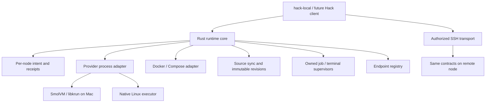

# Hack v5: fast, portable development execution

Status: candidate specification, September 9, 2026. Normative requirements describe the intended
product; the [work-unit ledger](work-units.md) records what is actually implemented. SmolVM/libkrun
is the chosen implementation direction, not a proven performance winner. No global installation,
active project migration, or production deployment is implied by this document.

## 1. User outcome

A person or agent can open a project, obtain ready services, edit with prompt reload, run a job
against an identified source revision, attach a terminal, and reconnect after a client disconnect.
They can see what is running, where its source and data live, why work is waiting, and what stopping
it will preserve. The same operations work on an authorized private remote machine.

Speed is time to a useful result. Installation, stopped-VM boot, resume, warm environment startup,
job admission, process start, and application readiness are different measurements. Registered
projects should be cheap; active databases, compilers, and browsers still consume real resources.

Ergonomics is part of acceptance: no unexplained copied checkout, lost terminal, stale reload,
surprising restart, hidden account switch, ambiguous target, or manual cleanup after ordinary use.

## 2. Scope and migration

The first usable local candidate covers one trusted user's Apple Silicon machine, a private
SmolVM execution pool, existing Compose projects, native source storage, incremental sync, bounded
jobs, persistent databases, loopback endpoints, and durable terminals. It is developed through
`hack-local`; the stable `hack` command keeps its current behavior and engine.

The v5 release target also includes Linux arm64/amd64 execution, authenticated private-node access,
source transfer, reconnect, host-native/slim execution, routing and environment compatibility,
packaged upgrades, and explicit migration. Each platform needs actual evidence. A Mac over SSH
does not qualify native Linux. Remote support is a new scoped adapter; it does not revive the
retired gateway, dispatch, hosted-account, ticket, or dashboard products.

Multiple untrusted principals, dedicated hostile-workload VM isolation, live VM checkpoints,
cross-host memory restore, automatic failover, GPU support, and provider provisioning are separate
capabilities. Their absence is explicit. A shared trusted pool never satisfies an `isolated-vm`
request by silently weakening its isolation.

Existing projects continue through v4 and OrbStack/Compose until explicitly enrolled in a candidate
workspace. One environment has one reconciler. Adoption of running v4 containers or volumes is
not supported during the candidate phase. Later migration requires a stopped/quiesced boundary,
data preservation, ownership transfer, endpoint switch, and a demonstrated rollback procedure.

## 3. Architecture

`packages/runtime-core` starts as one Rust crate with a library and a small executable. Pure plan
validation, identity, capability checks, and lifecycle decisions belong in the library. Effects
belong behind explicit adapters. Introduce a long-running user-scoped service when durable
execution requires it; offline parsing and inspection must not boot that service or a VM.

The candidate client initially invokes the Rust executable. A versioned request/result contract
will let the existing TypeScript CLI and SDK call the same core without duplicating decisions.
Do not add an FFI ABI, an embedded JavaScript engine, a new build engine, or extra crates merely
to resemble the eventual diagram. Split a helper where crash isolation, native permissions, or
independent process lifetime requires it. Rust's performance benefit must be measured.

Start with the pinned SmolVM CLI and its packaged libkrun behind a process adapter. Verify the
complete artifact, guest, ABI, and native signing requirements. Keep provider state, sockets,
caches, and mounts private to the candidate. Mac path isolation may require a provider-process
environment adapter; never change the shell's HOME or import the user's credential directories.
Direct libkrun ownership is justified only by a concrete capability gap or measured advantage.

Keep Docker/Compose in the guest initially. This preserves usable graph behavior while isolating
provider costs. A later containerd adapter must independently preserve dependencies, health,
source, storage, networking, and cancellation. Linux uses an explicit authorized engine endpoint;
it does not require a VM just to match the Mac implementation.

## 4. Execution and identity contract

The node owns execution decisions while a client is disconnected. Stable project, workspace,
environment, service, job, volume, terminal, and route identities are separate from human names,
paths, branch labels, PIDs, and provider profiles. Physical checkout identity and logical project
identity are distinct; discovering a fork does not adopt its ancestor's runtime.

Each mutation carries an operation ID, request digest, expected generation, principal, and explicit
target. The node persists intent before effects in a local transactional journal, initially
SQLite. Retries return the existing receipt; reusing an ID with different input conflicts. Expired
retry history is not permission to spawn again. Ambiguous effects are reconciled or quarantined.
There is no promise of exactly-once external application effects.

Jobs move through accepted, queued, preparing, running, finishing, and a durable terminal outcome.
Desired state, observed state, readiness, freshness, and uncertainty are separate. A process that
starts is not a ready service. A completed setup dependency requires successful completion; failed
setup prevents dependents from starting. Compensation removes only resources created by that
operation and reports incomplete cleanup.

Cancellation has a deadline and an owned escalation path. Confirm descendant absence before
claiming success. Supervisors use boot/start identity and ownership records, not a PID/name match.
An external tunnel or unmanaged process stays externally owned. One terminal writer lease can
coexist with multiple observers; detach does not stop the session or create a model turn.

Requests declare required capabilities before mutation: protocol, OS/architecture, execution
mode, isolation, source mode, limits, credential delivery, and evidence freshness. Unknown or
unenforced requirements return a typed refusal. No fallback to a global runtime is allowed.

## 5. Projects, source, and storage

The initial native plan is an internal versioned representation of a documented Compose subset.
Keep the original Compose definition intact. Parsing is side-effect-free; unsupported fields
produce a compatibility report. Images/builds, argv, profiles, ordinary mounts, health checks,
completion dependencies, environment references, endpoints, and limits need explicit tests.
Privileged mode, devices, host networking, external volumes, and provider extensions must be
explicitly delegated or rejected. A new `.hack/hack.yaml` authoring format is deferred until this
internal plan is stable; v5 does not require users to rewrite working definitions on day one.

Two workspace modes remain explicit:

- `host-mounted`: compatibility mode only where the backend's watcher and metadata behavior is
  qualified. Never silently replace missed notifications with global application polling.
- `node-native`: active source and writable build state live beside execution on native storage.
  Editing can happen there or through a declared single-writer sync from a client checkout.

Enrollment of a real project creates a separate candidate workspace. It does not alter its active
v4 generated directories. Source inclusion and exclusions are reviewable; credential files and
generated secret material are excluded unless a scoped delivery operation explicitly needs them.
Symlinks, permissions, case collisions, Unicode names, ignored/generated files, deletion, rename,
and overflow are part of the conformance contract. Conflicting writers stop sync visibly.

The development hot path sends coalesced changed files and bounded metadata; it does not rebuild
or commit an image per edit. Lost events trigger reconciliation. Preserve stable watcher roots
and explain any interval in which live source is partially updated. Surface the acknowledged
revision and sync lag. `exec` cannot pretend the editor's latest revision is already present.

Qualification jobs use immutable source snapshots, including selected dirty changes and config
identity. Validate a requested revision before launch; bind acceptance to that immutable input so
edits between acceptance and launch cannot change it. Later sync does not retarget an accepted
job. A fresh stale submission is rejected. Writable output and caches are separate mounts.

Use native Linux storage for Docker and containerd data and prove the correct mount after every
restart. Provider runtime PID/socket state must be ephemeral, separate from persistent root/data
overlays. Shut down guest services and flush data before stopping the VMM. Test sudden failure
separately; a clean-stop fix is not crash durability.

Volumes declare persistent, disposable, immutable, or externally managed policy. Ordinary down
preserves persistent data. Cleanup verifies exact ownership and attachments, then checks again
after restart. Cache sharing is keyed by architecture, toolchain, lockfiles, and relevant inputs;
mutable caches need writer arbitration. Database copies require a declared consistency contract.
No broad prune, implicit migration, or concurrent writable snapshot adoption.

## 6. Speed and resource policy

Reuse a warm trusted pool when it meets isolation and authority requirements. Avoid a VM per job
or workspace by default. Keep immutable images and dependency artifacts cached; keep mutable
workspaces, outputs, and data ownership separate. Bound builds and concurrent jobs. An opt-in idle
policy may stop eligible services or capacity, but excludes active sessions, running jobs, held
leases, and externally managed resources. Frozen processes still occupy memory.

Admission accounts for node, pool, project, and job budgets: memory, CPU, processes, disk, and
concurrency. Queue with a reason, age, deadline, and cancellation. Reserve interactive capacity
and prevent indefinite starvation. Count native applications and VM/helper overhead; configured
guest RAM is not a measurement of host usage. Unsupported hard limits are reported, not implied.

The existing private comparison's 16 GiB free-page floor remains an experiment control, not a
shipping minimum. Product admission will use measured headroom, pressure, and declared allocation
with an explicit operator policy. Changing an experiment threshold creates a new recorded cohort;
it cannot manufacture a passing result from an old failure.

Provisional optimization budgets are design goals, not release claims:

| Boundary | Candidate target / evidence |
| --- | --- |
| `hack-local info --json` | p95 ≤100 ms end to end, release build, 100 invocations on recorded host |
| Cached status with 1,000 registered objects | p95 ≤150 ms, warmed node; no runtime/credential side effects |
| Durable warm job admission | p95 ≤250 ms; queued wait and application work reported separately |
| Idle Rust control plane | <1% of one core over ten minutes; RSS trend and all helpers included separately |
| Small edit to watcher acknowledgement | p95 ≤200 ms for the pinned small fixture; actual application reload reported separately |
| Application reload/build | No unexplained regression against matched baseline; include a real project |
| Capacity boot, warm graph, peak memory | Measure first; no winner or fixed promise from preliminary single samples |
| Reclamation | Observe 0/5/15/30/60 seconds after workload stop, and after pool stop; record retained idle floor |

Use at least five rotated independent runs per comparable lifecycle configuration, retain raw
samples and failed attempts, and report median/range. Do not estimate tail percentiles from five
boots or treat inner-loop samples as independent boots. Record instrumentation delays, background
load, cache state, guest/kernel/engine differences, and local versus remote transport time. Memory
includes verified VM descendants and framework helpers; shared allocations are labeled incomparable.

## 7. Local and remote ergonomics

User-facing operations are plan, up/down, inspect/status, sync, job submit/result/cancel,
terminal attach/detach/stop, logs, and endpoint inspection. Names here are proposed beyond the
implemented `hack-local` checkpoint. Human output shows identity, location, readiness, and the
next useful action; JSON carries stable versions, typed errors, and bounded records.

Read-only commands never start services, repair CA files, write client configuration, refresh
credentials, or reserve a runner. If observations are unavailable or stale, say so. Stream logs
with bounded retention, pagination, backpressure, and explicit replay gaps. Slow consumers cannot
block cancellation or grow node memory indefinitely.

Remote execution uses the same plans and receipts over authenticated SSH. Explicitly select a
node; automatic placement ranges only over an authorized set. Prefer the node containing required
source/data and compatible caches. Do not move databases, secrets, or private source just to fit
an allocation. A node continues supervising accepted work while the client is offline; renewed
effects require valid grants. Reconnect by stable identity and generation, not by rerunning spawn.

Qualify durable terminals, bounded log continuation, source convergence after missing a delta,
loopback tunnels and reopen, cancellation, lost acknowledgements, and node restart on both Mac and
native Linux. Measure empty SSH round trips, persistent transport, transfer, and executor time
separately. No WAN-speed claim from local loopback results. Shared runners require explicit
reservation/drain/hand-back; cross-principal isolation is separately qualified.

Hack owns endpoint identity and exposure, initially loopback only in the candidate. Later DNS/TLS
consumers use the registry. Candidate route names, ports, certificates, and proxy state must not
collide with stable Hack. CA discovery is read-only; trust installation/rotation is explicit and
preserves native approvals. Readiness, dependency access, and application scenario success remain
different observations.

## 8. Authority, credentials, and portability

Record requester, authorizing principal, node/OS principal, workspace owner, and provider identity
when known. An agent name or profile label is not verified account identity. Provider credentials
stay with native authorization and secret-delivery systems; the core handles scoped references,
leases, and expiry. Do not copy credential stores into guests or put secret values in manifests,
public hashes, snapshots, receipts, prompts, or logs.

Preserve environment overlay precedence, service/host scope, worktree-local overrides, and linked
worktree inheritance. Resolve target-specific values; explain origins and availability with values
redacted. Toolchain and endpoint references are explicit. No automatic trust of copied project
configuration or global account switching to make a command succeed.

Host-native/slim parsing and scoped execution remain possible without a VM, GUI, Docker socket,
proxy, or CA. Persistent sessions require a supervisor. Host SDK/simulator operations stay on a
capable authorized host. Harness owns provider conversation/account semantics; Hack owns execution
and terminals. Optional clients and extensions use versioned out-of-process contracts, without
implicit installation or instruction rewrites.

## 9. Delivery and release evidence

Use the [work units](work-units.md) as the execution plan. Each unit has a positive demonstration,
a meaningful refusal/failure case, a cleanup/readback check, and an artifact a reviewer can inspect.
Record tests, actual runtime observations, performance, hosted CI, and packaged behavior separately.
No unit may mark a future command as implemented just because a design or mock exists.

Ship only after representative local and remote project workflows, restart/crash/disk-full races,
bounded resource behavior, ownership isolation, package verification, version negotiation, and
data-preserving migration/rollback pass on the declared platforms. A required failure blocks that
capability; an unavailable backend does not select another backend automatically.

Releases must verify exact CLI/core/helper/guest identities, artifact checksums, complete downloads,
native signing/entitlements, and protocol handshakes. Test mixed versions and old state. Keep the
installed v4 version intact throughout candidate development; publication follows the repository's
existing release gates and requires its own authorization.
